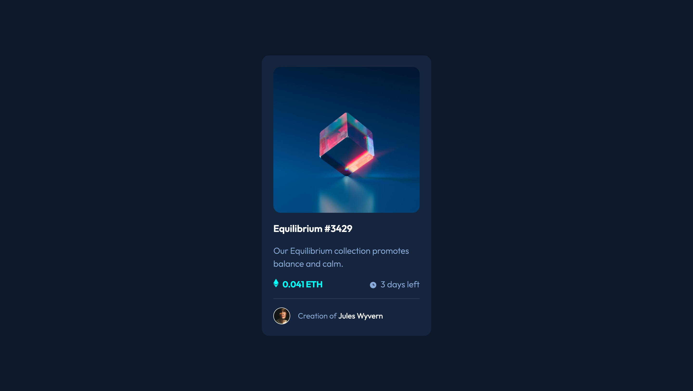

# Frontend Mentor - NFT preview card component solution

This is a solution to the [NFT preview card component challenge on Frontend Mentor](https://www.frontendmentor.io/challenges/nft-preview-card-component-SbdUL_w0U). Frontend Mentor challenges help you improve your coding skills by building realistic projects. 

## Table of contents

- [Overview](#overview)
  - [The challenge](#the-challenge)
  - [Screenshot](#screenshot)
  - [Links](#links)
- [My process](#my-process)
  - [Built with](#built-with)
  - [What I learned](#what-i-learned)
- [Author](#author)

## Overview

### The challenge

Users should be able to:

- View the optimal layout depending on their device's screen size
- See hover states for interactive elements

### Screenshot



### Links

- Solution URL: https://github.com/oanh-hth/FMS-NFT-Preview-Card-Component
- Live Site URL: https://oanh-hth.github.io/FMS-NFT-Preview-Card-Component
## My process

### Built with

- Semantic HTML5 markup
- CSS custom properties
- Flexbox
- Mobile-first workflow

### What I learned

In this challenge, I learned how to create a filter on an image when hovering it.

To see how I can add this effect, see below:

```html
<a href="#">
  
</a>
```
```css
div:first-of-type a::before {
    content: url('images/icon-view.svg');
    background-color: var(--color-cyan);
    display: none;
    align-items: center;
    justify-content: center;
    position: absolute;
    inset: 0;
    background-position: center;
    border-radius: 15px;
    opacity: 50%;
}

div:first-of-type a:hover::before,
div:first-of-type a:focus::before {
    display: flex;
}
```

## Author

- Frontend Mentor - [@oanh-hth](https://www.frontendmentor.io/profile/oanh-hth)


